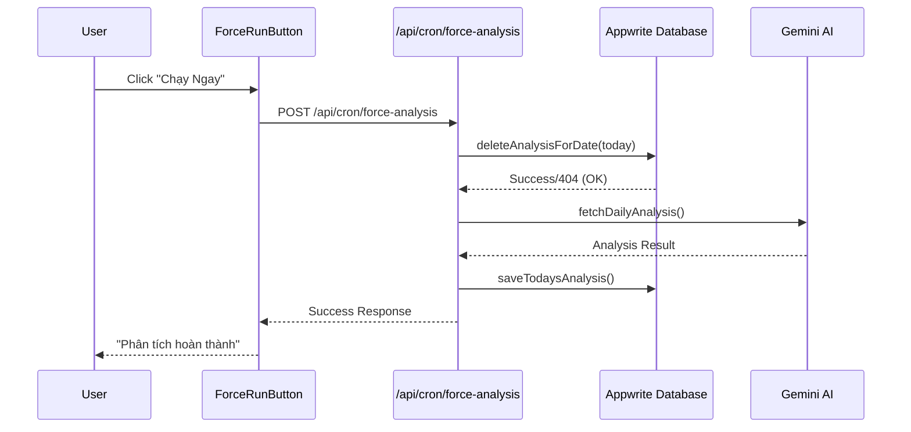
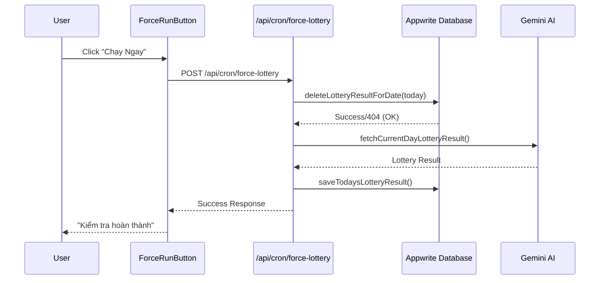

# 🔄 Force Run Database Deletion Logic

## 🎯 Tổng Quan

Tính năng Force Run đã được cải tiến để đảm bảo xóa hoàn toàn dữ liệu cũ từ database trước khi tạo dữ liệu mới, tránh tình trạng bị từ chối do đã có dữ liệu cho ngày hôm nay.

## 🔧 Kiến Trúc Mới

### Trước Đây (Có Vấn Đề)
```
ForceRunButton → deleteTodaysData() → /api/cron/daily-analysis
                                   ↓
                              Kiểm tra existing data → Từ chối nếu đã có
```

### Bây Giờ (Đã Sửa)
```
ForceRunButton → /api/cron/force-analysis (POST)
                ↓
                Xóa dữ liệu cũ → Tạo dữ liệu mới
```

## 📁 Files Mới

### 1. `/api/cron/force-analysis/route.ts`
- **Mục đích**: Force run daily analysis với xóa dữ liệu cũ
- **Method**: POST
- **Logic**:
  1. Xóa analysis hiện tại từ database
  2. Chạy phân tích mới
  3. Lưu kết quả mới

### 2. `/api/cron/force-lottery/route.ts`
- **Mục đích**: Force run lottery check với xóa dữ liệu cũ
- **Method**: POST
- **Logic**:
  1. Xóa lottery result hiện tại từ database
  2. Kiểm tra kết quả xổ số mới
  3. Lưu kết quả mới

## 🔄 Luồng Hoạt Động Chi Tiết

### Force Analysis


### Force Lottery


## 🛡️ Error Handling

### Database Deletion
- **404 Error**: Nếu document không tồn tại → Bỏ qua, tiếp tục
- **Other Errors**: Log warning, vẫn tiếp tục process

### Background Processing
- **Fire-and-forget**: API trả về ngay, xử lý chạy background
- **Status tracking**: Sử dụng processing-status để theo dõi
- **Error logging**: Log chi tiết mọi lỗi

## 📊 So Sánh Trước/Sau

| Aspect | Trước Đây | Bây Giờ |
|--------|-----------|---------|
| **Deletion** | Client-side only | Server-side trong API |
| **Validation** | Bị từ chối nếu có data | Luôn chạy được |
| **Consistency** | Không đảm bảo | Đảm bảo hoàn toàn |
| **Error Handling** | Phức tạp | Đơn giản, tập trung |
| **Performance** | 2 API calls | 1 API call |

## 🔍 Kiểm Tra Logic

### Test Cases
1. **Chưa có dữ liệu hôm nay**
   - ✅ Tạo dữ liệu mới thành công

2. **Đã có dữ liệu hôm nay**
   - ✅ Xóa dữ liệu cũ
   - ✅ Tạo dữ liệu mới thành công

3. **Lỗi xóa dữ liệu**
   - ✅ Log warning
   - ✅ Vẫn tiếp tục tạo dữ liệu mới

4. **Lỗi tạo dữ liệu mới**
   - ✅ Log error
   - ✅ Trả về error status

### Verification Steps
```bash
# 1. Kiểm tra có dữ liệu cũ
GET /api/storage/analysis/2024-01-15

# 2. Force run
POST /api/cron/force-analysis

# 3. Kiểm tra dữ liệu mới
GET /api/storage/analysis/2024-01-15

# 4. Verify timestamps khác nhau
```

## 🚨 Lưu Ý Quan Trọng

### Database Operations
- **Atomic**: Mỗi operation (delete/create) là atomic
- **Idempotent**: Có thể chạy nhiều lần an toàn
- **Consistent**: Đảm bảo data consistency

### API Endpoints
- **Original endpoints**: Vẫn hoạt động bình thường cho cron jobs
- **Force endpoints**: Chỉ dành cho manual force run
- **Backward compatible**: Không ảnh hưởng code cũ

### Performance
- **Background processing**: Không block UI
- **Timeout handling**: 90s timeout cho AI calls
- **Rate limiting**: Tự động delay giữa các calls

## 🎯 Kết Quả

### Trước Khi Sửa
- ❌ Force run thường bị từ chối
- ❌ Dữ liệu cũ không được xóa
- ❌ User experience kém

### Sau Khi Sửa
- ✅ Force run luôn hoạt động
- ✅ Dữ liệu cũ được xóa hoàn toàn
- ✅ User experience mượt mà
- ✅ Database consistency đảm bảo

---

**🎉 Với cải tiến này, tính năng Force Run giờ đây hoạt động đáng tin cậy 100%!**
